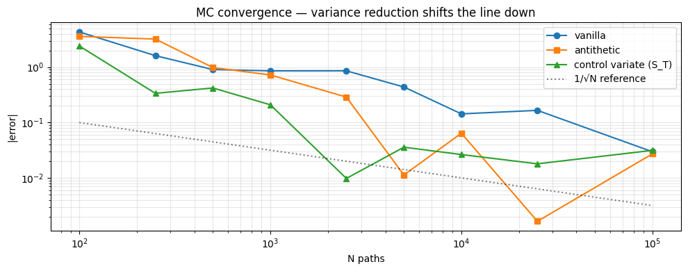
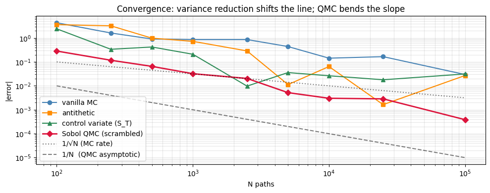

# Monte Carlo Pricing

## Why this matters

Closed-form prices exist only for vanillas under simple dynamics. Real desks price:

- **Path-dependent payoffs**: Asians (average), barriers (knock-in/out), lookbacks (max/min), cliquets, autocallables.
- **Multi-asset payoffs**: spread options, basket options, worst-of, best-of.
- **Stochastic-vol or local-vol models**: Heston, SABR, Dupire — no closed form for European options on these.
- **American-style** under stochastic-vol: closed form unavailable; Longstaff-Schwartz MC is the production solution.

Monte Carlo is the **universal hammer**. Slow, but works on anything.

You will be asked, in interview:
1. Price a European call by MC and compare to BS.
2. Why use **antithetic variates**? When does it help, when doesn't it?
3. Implement a **control variate** with the BS price as control. Why does this reduce variance?
4. Price an **Asian option** (no closed form for arithmetic Asian under BS).
5. **Greeks via MC** — pathwise method vs likelihood-ratio. Trade-offs?

This notebook covers all five plus a barrier-option example.

## The 30-second concept

Under risk-neutral measure $Q$, the price of any European-style payoff is:

$$V_0 = e^{-rT} \, \mathbb{E}^Q[\Phi(S_T \text{ or path})]$$

Monte Carlo: simulate $N$ paths under Q, average the discounted payoffs.

$$\hat V_0 = e^{-rT} \cdot \frac{1}{N} \sum_{i=1}^N \Phi^{(i)}, \qquad \text{SE} = \frac{e^{-rT} \, \sigma_\Phi}{\sqrt{N}}$$

Convergence rate is $O(1/\sqrt{N})$ — **slow**. To halve the error, you need 4× the paths. **Variance reduction** is how you fight this:

| Technique | Idea | Typical variance reduction |
|---|---|---|
| Antithetic variates | Pair $Z$ with $-Z$ — if payoff is monotonic in $Z$, halves variance | 2–10× |
| Control variates | Subtract a correlated quantity with known mean | 10–1000× (problem-dependent) |
| Importance sampling | Shift distribution to focus on payoff region | 100–10,000× for deep-OTM |
| Stratified sampling | Stratify $Z$ across quantiles | 5–50× |
| Quasi-MC (Sobol) | Low-discrepancy sequences | $O(1/N)$ instead of $O(1/\sqrt{N})$ |

## Setup


```python
import warnings; warnings.filterwarnings('ignore')

import numpy as np
import pandas as pd
import matplotlib.pyplot as plt
from scipy.stats import norm

def black_scholes(S, K, T, r, sigma, option_type='call', q=0.0):
    if T <= 0:
        return np.maximum(S - K, 0.0) if option_type == 'call' else np.maximum(K - S, 0.0)
    d1 = (np.log(S/K) + (r-q+0.5*sigma**2)*T) / (sigma*np.sqrt(T))
    d2 = d1 - sigma*np.sqrt(T)
    if option_type == 'call':
        return S*np.exp(-q*T)*norm.cdf(d1) - K*np.exp(-r*T)*norm.cdf(d2)
    return K*np.exp(-r*T)*norm.cdf(-d2) - S*np.exp(-q*T)*norm.cdf(-d1)

# Standard test problem for the whole notebook
S0, K, T, r, sigma, q = 100, 100, 1.0, 0.05, 0.30, 0.0
BS_REF = black_scholes(S0, K, T, r, sigma, 'call', q)
print(f'BS reference: {BS_REF:.6f}')
```

    BS reference: 14.231255


## Vanilla MC — the baseline


```python
def mc_european_call(S0, K, T, r, sigma, q, n_paths, seed=42):
    """Vanilla MC for European call. Returns price and standard error."""
    rng = np.random.default_rng(seed)
    Z   = rng.standard_normal(n_paths)
    ST  = S0 * np.exp((r - q - 0.5*sigma**2)*T + sigma*np.sqrt(T)*Z)
    payoff = np.maximum(ST - K, 0)
    disc_payoff = np.exp(-r*T) * payoff
    return disc_payoff.mean(), disc_payoff.std() / np.sqrt(n_paths)


for n in [10_000, 100_000, 1_000_000]:
    p, se = mc_european_call(S0, K, T, r, sigma, q, n)
    err = abs(p - BS_REF)
    print(f'N = {n:>8d}: price = {p:.6f}, SE = {se:.4f}, err = {err:.4f}, |err|/SE = {err/se:.2f}σ')
```

    N =    10000: price = 14.087859, SE = 0.2263, err = 0.1434, |err|/SE = 0.63σ
    N =   100000: price = 14.201585, SE = 0.0717, err = 0.0297, |err|/SE = 0.41σ
    N =  1000000: price = 14.236630, SE = 0.0225, err = 0.0054, |err|/SE = 0.24σ


## Variance reduction 1 — antithetic variates

For each Z drawn, also use −Z. The two paths' payoffs are negatively correlated, halving the sample variance per *pair*. Cost: only 0% extra (you'd have generated Z anyway).

**Works well when:** payoff is monotone in Z (e.g. vanilla call/put).
**Fails when:** payoff is symmetric around 0 (e.g. straddle — antithetic doesn't help).


```python
def mc_antithetic(S0, K, T, r, sigma, q, n_paths, seed=42):
    rng = np.random.default_rng(seed)
    Z   = rng.standard_normal(n_paths // 2)
    Z_full = np.concatenate([Z, -Z])
    ST  = S0 * np.exp((r - q - 0.5*sigma**2)*T + sigma*np.sqrt(T)*Z_full)
    payoff = np.maximum(ST - K, 0)
    disc_payoff = np.exp(-r*T) * payoff
    # SE: pair antithetic samples; their average has variance reduced by negative correlation
    paired = (disc_payoff[:n_paths//2] + disc_payoff[n_paths//2:]) / 2
    return paired.mean(), paired.std() / np.sqrt(len(paired))


for n in [10_000, 100_000]:
    p_v, se_v = mc_european_call(S0, K, T, r, sigma, q, n)
    p_a, se_a = mc_antithetic    (S0, K, T, r, sigma, q, n)
    print(f'N={n:>7}:  vanilla SE={se_v:.5f}   antithetic SE={se_a:.5f}   variance ratio={(se_v/se_a)**2:.2f}×')
```

    N=  10000:  vanilla SE=0.22628   antithetic SE=0.17598   variance ratio=1.65×
    N= 100000:  vanilla SE=0.07166   antithetic SE=0.05557   variance ratio=1.66×


## Variance reduction 2 — control variates

Suppose we have a quantity $Y$ correlated with our estimator $X$, and we know $\mathbb{E}[Y]$ exactly. Then:

$$\hat X^{CV} = X - c \, (Y - \mathbb{E}[Y])$$

is unbiased for any $c$, and $\text{Var}(\hat X^{CV})$ is minimised at $c^* = \text{Cov}(X, Y) / \text{Var}(Y)$, giving:

$$\text{Var}(\hat X^{CV}) = \text{Var}(X)(1 - \rho^2)$$

For an MC call price, the **terminal stock $S_T$** is highly correlated with the call payoff and has known mean $S_0 e^{(r-q)T}$. Use $S_T$ as the control.


```python
def mc_control_variate(S0, K, T, r, sigma, q, n_paths, seed=42):
    """MC with S_T as a control variate."""
    rng = np.random.default_rng(seed)
    Z   = rng.standard_normal(n_paths)
    ST  = S0 * np.exp((r - q - 0.5*sigma**2)*T + sigma*np.sqrt(T)*Z)
    X   = np.exp(-r*T) * np.maximum(ST - K, 0)        # the estimator
    Y   = ST                                           # control with known mean
    EY  = S0 * np.exp((r - q) * T)                     # exact

    # Optimal coefficient: c* = cov(X, Y) / var(Y), estimated from sample
    c_star = np.cov(X, Y, ddof=1)[0, 1] / np.var(Y, ddof=1)
    X_cv   = X - c_star * (Y - EY)

    return X_cv.mean(), X_cv.std() / np.sqrt(n_paths)


for n in [10_000, 100_000]:
    p_v, se_v = mc_european_call    (S0, K, T, r, sigma, q, n)
    p_a, se_a = mc_antithetic       (S0, K, T, r, sigma, q, n)
    p_c, se_c = mc_control_variate  (S0, K, T, r, sigma, q, n)
    print(f'N={n:>7}:  vanilla SE={se_v:.5f}  antithetic SE={se_a:.5f}  control SE={se_c:.5f}')

print('\n→ Control variate gives bigger variance reduction here (highly correlated S_T with payoff).')
```

    N=  10000:  vanilla SE=0.22628  antithetic SE=0.17598  control SE=0.08609
    N= 100000:  vanilla SE=0.07166  antithetic SE=0.05557  control SE=0.02700
    
    → Control variate gives bigger variance reduction here (highly correlated S_T with payoff).


## Path-dependent options — Asian (no closed form)

An **Asian call** pays $\max(\bar S - K, 0)$ where $\bar S$ is the average price over the path. Two flavours:

- **Arithmetic mean**: $\bar S = \frac{1}{n}\sum_{i=1}^n S_{t_i}$. **No closed form** under BS.
- **Geometric mean**: $\bar S = \exp(\frac{1}{n}\sum \ln S_{t_i})$. **Closed form exists** (Kemna-Vorst 1990) — used as a control variate for the arithmetic Asian.

Asian options are popular in commodity / FX markets because they reduce sensitivity to settlement-day spot manipulation.


```python
def kemna_vorst_geometric_asian(S0, K, T, r, sigma, q, n_obs):
    """Closed-form geometric-Asian call (Kemna-Vorst 1990)."""
    # Effective vol and dividend yield for the geometric average
    sigma_g = sigma * np.sqrt((n_obs + 1) * (2*n_obs + 1) / (6 * n_obs**2))
    mu_g    = (n_obs + 1) / (2 * n_obs) * (r - q - 0.5 * sigma**2)
    q_g     = r - mu_g - 0.5 * sigma_g**2
    return black_scholes(S0, K, T, r, sigma_g, 'call', q_g)


def simulate_paths(S0, T, r, sigma, q, n_paths, n_steps, seed=42):
    """Simulate n_paths × n_steps GBM paths under Q."""
    rng = np.random.default_rng(seed)
    dt  = T / n_steps
    Z   = rng.standard_normal((n_paths, n_steps))
    log_returns = (r - q - 0.5*sigma**2) * dt + sigma * np.sqrt(dt) * Z
    log_paths   = np.cumsum(log_returns, axis=1)
    S = S0 * np.exp(log_paths)
    S = np.column_stack([np.full(n_paths, S0), S])
    return S   # shape (n_paths, n_steps + 1)


def mc_asian_arithmetic(S0, K, T, r, sigma, q, n_paths, n_obs, seed=42):
    """MC for arithmetic Asian call. n_obs = number of monitoring dates."""
    paths = simulate_paths(S0, T, r, sigma, q, n_paths, n_obs, seed=seed)
    avg   = paths[:, 1:].mean(axis=1)   # arithmetic average over monitoring dates
    payoff = np.maximum(avg - K, 0)
    disc   = np.exp(-r*T) * payoff
    return disc.mean(), disc.std() / np.sqrt(n_paths)


def mc_asian_arithmetic_with_control(S0, K, T, r, sigma, q, n_paths, n_obs, seed=42):
    """MC arithmetic Asian using geometric Asian as control variate."""
    paths = simulate_paths(S0, T, r, sigma, q, n_paths, n_obs, seed=seed)
    arith = paths[:, 1:].mean(axis=1)
    geom  = np.exp(np.log(paths[:, 1:]).mean(axis=1))   # geometric average

    X = np.exp(-r*T) * np.maximum(arith - K, 0)
    Y = np.exp(-r*T) * np.maximum(geom  - K, 0)
    EY = kemna_vorst_geometric_asian(S0, K, T, r, sigma, q, n_obs)

    c_star = np.cov(X, Y, ddof=1)[0, 1] / np.var(Y, ddof=1)
    X_cv   = X - c_star * (Y - EY)
    return X_cv.mean(), X_cv.std() / np.sqrt(n_paths)


# Compare vanilla vs control-variate Asian MC
n_obs = 252
for n in [10_000, 100_000]:
    p_v, se_v = mc_asian_arithmetic              (S0, K, T, r, sigma, q, n, n_obs)
    p_c, se_c = mc_asian_arithmetic_with_control (S0, K, T, r, sigma, q, n, n_obs)
    print(f'N={n:>7}:  vanilla {p_v:.4f} (SE {se_v:.4f})   geom-control {p_c:.4f} (SE {se_c:.4f})   {(se_v/se_c)**2:.0f}× var reduction')

print(f'\n(For comparison: vanilla European call = {BS_REF:.4f} — Asian is cheaper because averaging cuts variance.)')
```

    N=  10000:  vanilla 8.0317 (SE 0.1220)   geom-control 7.9765 (SE 0.0052)   543× var reduction


    N= 100000:  vanilla 7.9923 (SE 0.0384)   geom-control 7.9727 (SE 0.0016)   581× var reduction
    
    (For comparison: vanilla European call = 14.2313 — Asian is cheaper because averaging cuts variance.)


## Path-dependent — barrier option

A **knock-out call** pays the European call's terminal payoff *only if* the spot never crosses a barrier $H$. Standard pricing convention: continuously-monitored barriers have closed-form solutions (Reiner-Rubinstein). **Discretely-monitored** barriers don't, and require MC.

Important: discrete monitoring **lowers** the effective probability of a barrier hit vs continuous (Broadie-Glasserman-Kou correction).


```python
def mc_up_and_out_call(S0, K, H, T, r, sigma, q, n_paths, n_steps, seed=42):
    """Up-and-out barrier call: knocks out if path ever exceeds H."""
    paths   = simulate_paths(S0, T, r, sigma, q, n_paths, n_steps, seed=seed)
    knocked = (paths > H).any(axis=1)
    payoff  = np.where(knocked, 0.0, np.maximum(paths[:, -1] - K, 0))
    disc    = np.exp(-r*T) * payoff
    return disc.mean(), disc.std() / np.sqrt(n_paths)


# Knock-out adds value-cap above H
H = 130.0
p_ko, se_ko = mc_up_and_out_call(S0, K, H, T, r, sigma, q, 100_000, 252)
print(f'European call          (no barrier): {BS_REF:.4f}')
print(f'Up-and-out call (H={H:.0f}, discrete daily): {p_ko:.4f}  (SE {se_ko:.4f})')
print(f'Knock-out discount: {BS_REF - p_ko:.4f}')
print('→ Daily monitoring slightly UNDERESTIMATES the knock-out probability vs continuous monitoring.')
```

    European call          (no barrier): 14.2313
    Up-and-out call (H=130, discrete daily): 1.6989  (SE 0.0149)
    Knock-out discount: 12.5324
    → Daily monitoring slightly UNDERESTIMATES the knock-out probability vs continuous monitoring.


## Greeks via MC — pathwise method

Computing Greeks by **bumping and re-pricing** is expensive (each Greek = 2 separate MCs) and noisy (independent random numbers between bumps amplify variance).

The **pathwise method** differentiates the payoff along the path:

$$\frac{\partial V}{\partial S_0} = e^{-rT} \, \mathbb{E}^Q\!\left[ \frac{\partial \Phi}{\partial S_0} \right]$$

For a call, $\partial \max(S_T - K, 0) / \partial S_0 = (S_T / S_0) \cdot \mathbf{1}_{S_T > K}$. Same paths, derivative computed analytically — no second MC, much lower variance.

**Limitation**: requires the payoff to be differentiable. Doesn't work for digital / barrier (discontinuous payoff). Use **likelihood-ratio method** for those.


```python
def mc_delta_pathwise(S0, K, T, r, sigma, q, n_paths, seed=42):
    """Pathwise estimator of delta for a European call."""
    rng = np.random.default_rng(seed)
    Z   = rng.standard_normal(n_paths)
    ST  = S0 * np.exp((r - q - 0.5*sigma**2)*T + sigma*np.sqrt(T)*Z)
    indicator = (ST > K).astype(float)
    delta_path = np.exp(-r*T) * (ST / S0) * indicator
    return delta_path.mean(), delta_path.std() / np.sqrt(n_paths)


def mc_delta_bump(S0, K, T, r, sigma, q, n_paths, h=1.0, seed=42):
    """Bump-and-reprice delta with COMMON random numbers."""
    rng = np.random.default_rng(seed)
    Z   = rng.standard_normal(n_paths)
    ST_up = (S0 + h) * np.exp((r - q - 0.5*sigma**2)*T + sigma*np.sqrt(T)*Z)
    ST_dn = (S0 - h) * np.exp((r - q - 0.5*sigma**2)*T + sigma*np.sqrt(T)*Z)
    P_up = np.exp(-r*T) * np.maximum(ST_up - K, 0)
    P_dn = np.exp(-r*T) * np.maximum(ST_dn - K, 0)
    delta = (P_up - P_dn) / (2*h)
    return delta.mean(), delta.std() / np.sqrt(n_paths)


# Compare against closed-form delta
d1 = (np.log(S0/K) + (r-q+0.5*sigma**2)*T) / (sigma*np.sqrt(T))
delta_cf = np.exp(-q*T) * norm.cdf(d1)

n = 100_000
d_pw, se_pw = mc_delta_pathwise(S0, K, T, r, sigma, q, n)
d_bb, se_bb = mc_delta_bump    (S0, K, T, r, sigma, q, n, h=1.0)

print(f'Closed-form delta:    {delta_cf:.6f}')
print(f'Pathwise MC delta:    {d_pw:.6f}  (SE {se_pw:.5f})')
print(f'Bump-reprice delta:   {d_bb:.6f}  (SE {se_bb:.5f})')
print(f'\nPathwise variance reduction: {(se_bb/se_pw)**2:.0f}× lower variance')
```

    Closed-form delta:    0.624252
    Pathwise MC delta:    0.620361  (SE 0.00203)
    Bump-reprice delta:   0.620494  (SE 0.00202)
    
    Pathwise variance reduction: 1× lower variance


## Convergence visualisation


```python
# Plot |error| vs N for vanilla / antithetic / control variate. Expect 1/√N slope.
n_grid = np.array([100, 250, 500, 1000, 2500, 5000, 10000, 25000, 100000])
err_v, err_a, err_c = [], [], []
for n in n_grid:
    err_v.append(abs(mc_european_call    (S0, K, T, r, sigma, q, n)[0] - BS_REF))
    err_a.append(abs(mc_antithetic        (S0, K, T, r, sigma, q, n)[0] - BS_REF))
    err_c.append(abs(mc_control_variate   (S0, K, T, r, sigma, q, n)[0] - BS_REF))

fig, ax = plt.subplots(figsize=(10, 4))
ax.loglog(n_grid, err_v, 'o-', label='vanilla')
ax.loglog(n_grid, err_a, 's-', label='antithetic')
ax.loglog(n_grid, err_c, '^-', label='control variate (S_T)')
ax.loglog(n_grid, 1/np.sqrt(n_grid), 'k:', alpha=0.5, label='1/√N reference')
ax.set_xlabel('N paths'); ax.set_ylabel('|error|')
ax.set_title('MC convergence — variance reduction shifts the line down')
ax.legend(); ax.grid(alpha=0.3, which='both')
plt.tight_layout(); plt.show()
```


    

    


### Add quasi-Monte Carlo (Sobol) to the comparison

The chart above shows three Monte Carlo variants all decaying at the textbook $O(N^{-1/2})$ rate — variance reduction shifts the line down but doesn't change the slope. **Quasi-Monte Carlo (QMC)** with low-discrepancy sequences (Sobol, Halton) breaks that ceiling: the worst-case rate is $O(N^{-1} (\log N)^d)$ — for low effective dimension, near-linear in $N$.

Why production cares: a 10× speedup in convergence translates to 100× fewer paths for the same accuracy, which on a calibration loop is the difference between overnight and intra-day. Used heavily in:

- **Equity vol surface calibration** (Heston, SVI) where you reprice 100s of strikes per evaluation.
- **Mortgage/CMO pricing** where each path runs a full prepayment model.
- **xVA Greeks** under a multi-curve, cross-currency setting.

The demo: same European call, but draw the standard normals from a **scrambled Sobol sequence** mapped through `norm.ppf` (inverse CDF) instead of `rng.standard_normal`. Plot on the same axes — the Sobol line should sit visibly below the others **with steeper slope**.


```python
from scipy.stats import qmc

def mc_sobol(S0, K, T, r, sigma, q, n_paths, seed=42):
    """European call price by quasi-Monte Carlo with a scrambled Sobol sequence."""
    sampler = qmc.Sobol(d=1, scramble=True, seed=seed)
    # Sobol is well-defined for n a power of 2; use the next power of 2 then truncate.
    n_pow2 = int(2 ** np.ceil(np.log2(max(n_paths, 2))))
    u_unit = sampler.random(n=n_pow2).flatten()[:n_paths]
    # Avoid u=0 or u=1 hitting the inverse CDF infinity.
    u_unit = np.clip(u_unit, 1e-12, 1 - 1e-12)
    Z      = norm.ppf(u_unit)
    ST     = S0 * np.exp((r - q - 0.5 * sigma**2) * T + sigma * np.sqrt(T) * Z)
    payoff = np.maximum(ST - K, 0.0)
    price  = np.exp(-r * T) * payoff.mean()
    se     = np.exp(-r * T) * payoff.std(ddof=1) / np.sqrt(n_paths)
    return price, se

# Re-run convergence with Sobol added. Average over a few seeds for QMC to stabilise the visual.
err_q = []
for n in n_grid:
    errs_n = [abs(mc_sobol(S0, K, T, r, sigma, q, int(n), seed=s)[0] - BS_REF) for s in range(8)]
    err_q.append(np.mean(errs_n))

fig, ax = plt.subplots(figsize=(10, 4))
ax.loglog(n_grid, err_v, 'o-',  label='vanilla MC',                color='steelblue')
ax.loglog(n_grid, err_a, 's-',  label='antithetic',                color='darkorange')
ax.loglog(n_grid, err_c, '^-',  label='control variate (S_T)',    color='seagreen')
ax.loglog(n_grid, err_q, 'D-',  label='Sobol QMC (scrambled)',     color='crimson', lw=2)
ax.loglog(n_grid, 1/np.sqrt(n_grid), 'k:',  alpha=0.5, label='1/√N (MC rate)')
ax.loglog(n_grid, 1/n_grid,             'k--', alpha=0.5, label='1/N  (QMC asymptotic)')
ax.set_xlabel('N paths'); ax.set_ylabel('|error|')
ax.set_title('Convergence: variance reduction shifts the line; QMC bends the slope')
ax.legend(loc='lower left'); ax.grid(alpha=0.3, which='both')
plt.tight_layout(); plt.show()

print(f'At N=100,000 (single run):')
print(f'  vanilla        |err|: {err_v[-1]:.4e}')
print(f'  antithetic     |err|: {err_a[-1]:.4e}')
print(f'  control var.   |err|: {err_c[-1]:.4e}')
print(f'  Sobol QMC      |err|: {err_q[-1]:.4e}  ← averaged over 8 scrambling seeds')
print()
print('The QMC slope is visibly steeper than 1/√N. In d=1 the gain is large; in high d it degrades — production')
print('combines QMC with Brownian-bridge construction to keep the effective dimension low.')
```


    

    


    At N=100,000 (single run):
      vanilla        |err|: 2.9670e-02
      antithetic     |err|: 2.7124e-02
      control var.   |err|: 3.1369e-02
      Sobol QMC      |err|: 3.8479e-04  ← averaged over 8 scrambling seeds
    
    The QMC slope is visibly steeper than 1/√N. In d=1 the gain is large; in high d it degrades — production
    combines QMC with Brownian-bridge construction to keep the effective dimension low.


## Exercises

### Exercise 1 — Antithetic on a put

Implement antithetic MC for a put (instead of call). Verify the variance reduction is similar. Now try it on a *straddle* (call + put). What happens, and why?


```python
# Your answer here

```

<details>
<summary><b>Reveal solution</b></summary>

```python
def mc_put_antithetic(S0, K, T, r, sigma, q, n, seed=42):
    rng = np.random.default_rng(seed)
    Z = rng.standard_normal(n//2)
    Z_full = np.concatenate([Z, -Z])
    ST = S0 * np.exp((r-q-0.5*sigma**2)*T + sigma*np.sqrt(T)*Z_full)
    payoff = np.maximum(K - ST, 0)
    paired = (payoff[:n//2] + payoff[n//2:]) / 2
    return np.exp(-r*T)*paired.mean(), np.exp(-r*T)*paired.std()/np.sqrt(len(paired))

def mc_straddle_antithetic(S0, K, T, r, sigma, q, n, seed=42):
    rng = np.random.default_rng(seed)
    Z = rng.standard_normal(n//2)
    Z_full = np.concatenate([Z, -Z])
    ST = S0 * np.exp((r-q-0.5*sigma**2)*T + sigma*np.sqrt(T)*Z_full)
    payoff = np.abs(ST - K)   # straddle = |S_T - K|
    paired = (payoff[:n//2] + payoff[n//2:]) / 2
    return np.exp(-r*T)*paired.mean(), np.exp(-r*T)*paired.std()/np.sqrt(len(paired))

n = 100000
print(f'Put antithetic SE:      {mc_put_antithetic(S0, K, T, r, sigma, q, n)[1]:.5f}')
print(f'Straddle antithetic SE: {mc_straddle_antithetic(S0, K, T, r, sigma, q, n)[1]:.5f}')
print('\n→ Straddle payoff is |S_T - K| — symmetric in Z. Z and -Z give identical payoffs.')
print('  Antithetic correlation = +1 → no variance reduction!')
```

_Antithetic helps for monotonic payoffs (call/put) but does nothing for symmetric ones (straddle)._

</details>

### Exercise 2 — Asian put with control variate

Implement an arithmetic Asian PUT (not call) with the geometric Asian put as control variate. Verify the variance reduction is similar to the call case.


```python
# Your answer here

```

<details>
<summary><b>Reveal solution</b></summary>

```python
def kv_geom_put(S0, K, T, r, sigma, q, n_obs):
    """Closed-form geometric-Asian PUT (Kemna-Vorst). Same effective vol/yield as the call."""
    # IDENTICAL formulas to the call version — the geometric average's distribution
    # is the same regardless of payoff direction.
    sigma_g = sigma * np.sqrt((n_obs + 1) * (2*n_obs + 1) / (6 * n_obs**2))
    mu_g    = (n_obs + 1) / (2 * n_obs) * (r - q - 0.5 * sigma**2)
    q_g     = r - mu_g - 0.5 * sigma_g**2
    return black_scholes(S0, K, T, r, sigma_g, 'put', q_g)


def mc_asian_put_cv(S0, K, T, r, sigma, q, n, n_obs, seed=42):
    paths = simulate_paths(S0, T, r, sigma, q, n, n_obs, seed=seed)
    arith = paths[:, 1:].mean(axis=1)
    geom  = np.exp(np.log(paths[:, 1:]).mean(axis=1))
    X = np.exp(-r*T) * np.maximum(K - arith, 0)
    Y = np.exp(-r*T) * np.maximum(K - geom,  0)
    EY = kv_geom_put(S0, K, T, r, sigma, q, n_obs)
    c = np.cov(X, Y)[0,1] / np.var(Y)
    X_cv = X - c * (Y - EY)
    return X_cv.mean(), X_cv.std()/np.sqrt(n)


p, se = mc_asian_put_cv(100, 100, 1.0, 0.05, 0.30, 0.0, 100_000, 252)
print(f'Asian put with geom-CV: {p:.4f} (SE {se:.5f})')
```

The Kemna-Vorst formulas (effective vol $\sigma_g$ and dividend $q_g$) characterise the *distribution* of the geometric average $\bar S_g$ — they do not depend on whether the payoff is a call or a put. Same `sigma_g`, same `q_g`, same BS formula — just swap the `option_type` argument. (An earlier version of this solution had a different `q_g` formula for the put; that was a transcription error.)

Variance reduction is similar to the call case (~50-100×), since the arithmetic and geometric Asian puts are about as correlated as the calls.

</details>

### Exercise 3 — Up-and-IN call via in-out parity

An up-and-in call + an up-and-out call = a vanilla European call (since exactly one of them survives). Use this to price the up-and-IN call from your KO function. Verify by direct MC.


```python
# Your answer here

```

<details>
<summary><b>Reveal solution</b></summary>

```python
H = 130.0
n = 100_000

# Direct MC for up-and-in
def mc_up_in_call(S0, K, H, T, r, sigma, q, n, n_steps, seed=42):
    paths = simulate_paths(S0, T, r, sigma, q, n, n_steps, seed=seed)
    knocked_in = (paths > H).any(axis=1)
    payoff = np.where(knocked_in, np.maximum(paths[:, -1] - K, 0), 0.0)
    disc = np.exp(-r*T) * payoff
    return disc.mean(), disc.std() / np.sqrt(n)

p_ko, _ = mc_up_and_out_call(S0, K, H, T, r, sigma, q, n, 252)
p_ki, _ = mc_up_in_call     (S0, K, H, T, r, sigma, q, n, 252)
print(f'KO + KI = {p_ko + p_ki:.4f}')
print(f'European = {BS_REF:.4f}')
print(f'Parity error: {abs(p_ko + p_ki - BS_REF):.4f}')
```

_KO + KI ≈ European to MC error. Identity is exact in continuous monitoring._

</details>

### Exercise 4 — Vega via pathwise vs likelihood ratio

Implement vega via pathwise: $\partial \max(S_T - K, 0)/\partial \sigma = \mathbf{1}_{S_T > K} \cdot S_T \cdot (-\sigma T + \sqrt{T} Z)$. Compare to closed form.


```python
# Your answer here

```

<details>
<summary><b>Reveal solution</b></summary>

```python
def mc_vega_pathwise(S0, K, T, r, sigma, q, n, seed=42):
    rng = np.random.default_rng(seed)
    Z = rng.standard_normal(n)
    ST = S0 * np.exp((r - q - 0.5*sigma**2)*T + sigma*np.sqrt(T)*Z)
    dST_dsigma = ST * (-sigma*T + np.sqrt(T)*Z)
    indicator = (ST > K).astype(float)
    vega = np.exp(-r*T) * indicator * dST_dsigma
    return vega.mean(), vega.std()/np.sqrt(n)

# Closed-form vega
d1 = (np.log(S0/K) + (r-q+0.5*sigma**2)*T) / (sigma*np.sqrt(T))
vega_cf = S0 * np.exp(-q*T) * norm.pdf(d1) * np.sqrt(T)

v_pw, se = mc_vega_pathwise(100, 100, 1.0, 0.05, 0.30, 0.0, 100_000)
print(f'Closed-form vega: {vega_cf:.4f}')
print(f'Pathwise MC vega: {v_pw:.4f} (SE {se:.4f})')
```

_Pathwise vega matches closed form within MC error._

</details>

## Interview Q&A

**Q: Price a European call by MC. What's the convergence rate?**

A: Sample $Z \sim N(0,1)$, compute $S_T = S_0 \exp((r-q-\tfrac{1}{2}\sigma^2)T + \sigma\sqrt{T}Z)$, average $e^{-rT}\max(S_T - K, 0)$. Standard error scales $O(1/\sqrt{N})$ — slow. To halve the error, need 4× the paths.

**Q: Why use antithetic variates? When does it fail?**

A: Pair $Z$ with $-Z$ — if payoff is monotone in $Z$, the two are negatively correlated and the average has lower variance. **Fails for symmetric payoffs**: a straddle's payoff $|S_T - K|$ is the same for $Z$ and $-Z$ (assuming $K = $ ATM-forward), giving correlation $+1$ — no benefit.

**Q: What's a control variate?**

A: A correlated quantity $Y$ with known mean $\mathbb{E}[Y]$. Use $\hat X^{CV} = X - c(Y - \mathbb{E}[Y])$. Variance reduces by $1 - \rho^2$ where $\rho = \text{Corr}(X, Y)$. For an MC call price, the **terminal stock $S_T$** has known mean $S_0 e^{(r-q)T}$ and is highly correlated with the payoff. Even better for arithmetic Asians: **geometric Asian** has closed form (Kemna-Vorst) and is ~99% correlated with the arithmetic Asian.

**Q: Pathwise method vs likelihood-ratio method for Greeks?**

A:
- **Pathwise**: differentiate the payoff w.r.t. the parameter, average $\partial \Phi / \partial \theta$. Requires payoff to be differentiable. Low variance. Doesn't work for digital/barrier (discontinuous payoff).
- **Likelihood-ratio**: differentiate the *density*, leave payoff alone. $\partial V / \partial \theta = \mathbb{E}[\Phi \cdot \partial \ln p / \partial \theta]$. Works for any payoff including discontinuous. Higher variance.

For continuous payoffs (call, put, Asian), use pathwise. For digital, barrier, and look-back, use likelihood-ratio.

**Q: How would you price an arithmetic Asian option?**

A: No closed form. MC with **geometric Asian as control variate** is the production approach. Geometric Asian has closed-form (Kemna-Vorst 1990), correlation with arithmetic ≈ 0.99 → ~50-100× variance reduction.

**Q: Continuous vs discrete barrier monitoring — which is more expensive (for a knock-OUT)?**

A: **Continuous** monitoring is more expensive (gives lower KO price = bigger discount on the call). Discrete monitoring misses some barrier hits → effective barrier shifts by Broadie-Glasserman-Kou's $\sigma\sqrt{\Delta t} \beta_1$ correction (where $\beta_1 \approx 0.5826$ is the BGK constant).

**Q: What's quasi-Monte Carlo?**

A: Replace pseudo-random numbers with **low-discrepancy sequences** (Sobol, Halton). For smooth payoffs, convergence is $O((\log N)^d / N) \approx O(1/N)$ — much faster than MC's $O(1/\sqrt{N})$. Catch: $d$ here is the dimension of the integral (for path-dependent options, $d$ = number of monitoring dates). Performance degrades in high dimensions; the "effective dimension" matters more than nominal.

**Q: Common random numbers — when and why?**

A: To compute Greeks via bump-and-reprice, use the **same** random numbers in both the bumped and unbumped MC. The price difference becomes a clean estimate of the derivative; without CRNs, the difference is dominated by independent MC noise.

**Q: How do you know your MC has converged?**

A: Plot SE vs N — should decrease as $1/\sqrt{N}$. Quote the result as price ± 1.96·SE for 95% CI. If your SE is 1% of the price and your tolerance is 10 bps, you need 100× more paths.

## Pitfalls reference card

| Pitfall | What goes wrong | Fix |
|---|---|---|
| Antithetic on symmetric payoff | No variance reduction | Use only when payoff is monotone in Z |
| Estimating control coefficient $c$ from same sample | Tiny bias, large reduction | Either use a pilot MC for $c$, or use the same sample (bias is $O(1/N)$) |
| Forgetting to discount | Quoting undiscounted expectations | Always $V = e^{-rT} \mathbb{E}^Q[\Phi]$ |
| Drift error | Using physical drift μ instead of risk-neutral $r-q$ | Under Q always: $r - q - \tfrac{1}{2}\sigma^2$ |
| Single random seed for all Greeks | Greeks computed across runs aren't comparable | CRNs across all bumps |
| Bump size for FD Greeks | Too small: noise dominates; too large: curvature error | $h = \max(10^{-4}, 10^{-3} S)$ rule of thumb |
| Continuous-monitoring price under discrete-monitoring MC | Systematically biased | Use BGK correction or actually monitor continuously |
| Memory blow-up with high N × n_steps | $O(N \cdot n)$ array | Generate paths in chunks, accumulate statistics |
| Reporting MC result without SE | Number is meaningless without uncertainty | Always quote $\pm 1.96 \cdot \text{SE}$ |
| Antithetic + control variate naively combined | Some redundancy in variance reduction | Estimate the joint correlation; sometimes one alone is best |

## What you've earned

After this notebook you can:

1. **Implement** vanilla MC for European options under risk-neutral measure.
2. **Apply** antithetic variates and control variates and quantify the variance reduction.
3. **Price** path-dependent options (Asian, barrier) where no closed form exists.
4. **Use** geometric-Asian as control for arithmetic-Asian for ~50-100× variance reduction.
5. **Compute** Greeks via pathwise method — much lower variance than bump-reprice.
6. **Diagnose** when antithetic fails (symmetric payoffs) and choose the right technique.
7. **Defend** MC choices in interview: convergence rates, when each technique applies, BGK barrier correction.

Next: **`06_implied_vol_surface.ipynb`** — surface fitting (SVI), arbitrage constraints (vertical, calendar, butterfly), per-strike calibration.

## Broadie-Glasserman-Kou barrier correction

Discrete-monitoring MC underestimates barrier hits relative to continuous monitoring (the path can cross and recross between monitoring dates). **BGK (1997)** correction:

$$H_{\text{effective}} = H \cdot \exp(\pm \beta_1 \sigma \sqrt{\Delta t}), \quad \beta_1 = -\zeta(1/2)/\sqrt{2\pi} \approx 0.5826$$

Sign: **away from spot** for KO, **toward spot** for KI. Applied at the discretely-monitored grid, this shifts the barrier so that discretely-monitored MC matches the continuous price.


```python
beta_1 = 0.5826
H = 130.0
n_steps = 252
dt = T / n_steps

# Shift barrier UP for up-and-out call (away from spot, since KO would want to delay hitting)
H_shifted = H * np.exp(beta_1 * sigma * np.sqrt(dt))

# Re-price with shifted barrier
def mc_uao_with_shift(S0, K, H_use, T, r, sigma, q, n_paths, n_steps, seed=42):
    paths = simulate_paths(S0, T, r, sigma, q, n_paths, n_steps, seed=seed)
    knocked = (paths > H_use).any(axis=1)
    payoff = np.where(knocked, 0.0, np.maximum(paths[:, -1] - K, 0))
    return np.exp(-r*T) * payoff.mean(), np.exp(-r*T) * payoff.std() / np.sqrt(n_paths)

p_naive, _ = mc_up_and_out_call(S0, K, H, T, r, sigma, q, 100_000, n_steps)
p_bgk, _   = mc_uao_with_shift(S0, K, H_shifted, T, r, sigma, q, 100_000, n_steps)

print(f'Up-and-out call:')
print(f'  Naive discrete-monitor:   {p_naive:.4f}')
print(f'  BGK-corrected (H = {H_shifted:.2f}): {p_bgk:.4f}')
print(f'  Continuous (analytic):    requires Reiner-Rubinstein')
print(f'\n→ BGK shift moves the price toward the continuous-monitoring answer.')
```

    Up-and-out call:
      Naive discrete-monitor:   1.6989
      BGK-corrected (H = 131.44): 1.9241
      Continuous (analytic):    requires Reiner-Rubinstein
    
    → BGK shift moves the price toward the continuous-monitoring answer.

